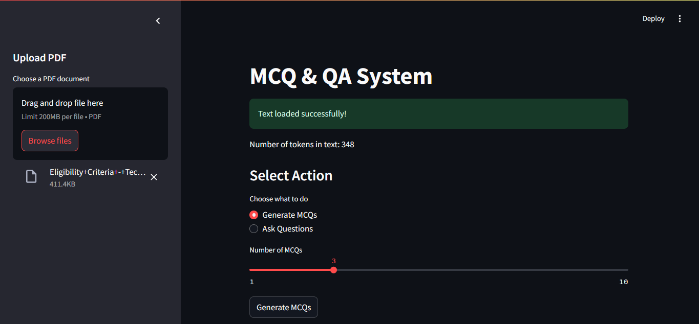
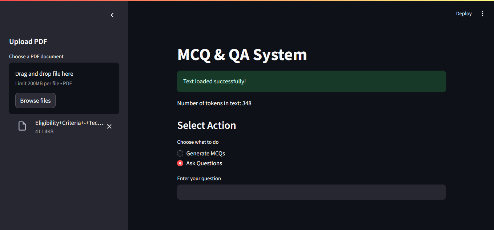

# 📘 PDF MCQ & QA Generator

An **AI-powered study assistant** that transforms your PDFs into interactive learning tools!  
Upload a PDF to **automatically generate high-quality multiple-choice questions (MCQs)** and **ask intelligent questions** about its content—locally, privately, and instantly.

---

## 🚀 Features

- **PDF Text Extraction** using `pdfplumber`  
- **Automatic MCQ Generation** with realistic options and answers  
- **Intelligent Question Answering** based on PDF context  
- **Embeddings-based Vector Search** for robust document retrieval  
- **Modern, Responsive UI** built with Streamlit  
- **Private & Offline**: Your data never leaves your device

---

## 📸 Preview

| MCQ Generation Mode           | QA Mode                        |
|-------------------------------|--------------------------------|
|  |  |

---

## 🏗️ Tech Stack

| Component      | Technology      |
|----------------|----------------|
| Frontend / UI  | Streamlit      |
| Text Extraction| pdfplumber     |
| Vector Store   | FAISS, LangChain|
| LLM Engine     | Ollama (LLaMA 3.1) |
| Language       | Python 3.10+   |

---

## ⚙️ Installation & Setup

#### 1. Clone the repository

```bash
git clone https://github.com/Avinash1025/pdf-ai-mcq-qa.git
cd pdf-ai-mcq-qa
```

#### 2. Create and activate a virtual environment

```bash
python -m venv venv

On Windows
venv\Scripts\activate

On Linux/macOS
source venv/bin/activate
```

#### 3. Install dependencies

```bash
pip install -r requirements.txt
```

#### 4. Make sure Ollama is running with LLaMA model

```bash
ollama pull llama3.1
```

#### 5. Run the Streamlit application

```bash
streamlit run app.py
```

---


## 🖥️ How It Works

1. **Upload any PDF** (study notes, books, handouts, etc.)
2. **Generate MCQs**: Instantly create multiple-choice questions for self-testing and exam prep.
3. **Ask Questions**: Query any concept covered in the document and get an AI-powered answer.  
4. **Enjoy an intuitive UI**: Easily switch between MCQ creation and QA modes.

---

## 🧩 Project Structure

```bash
pdf-ai-mcq-qa/
│
├── app.py # Main Streamlit app
├── utils.py # Core logic for text extraction, MCQ, QA
├── requirements.txt # Dependencies
├── README.md # Project documentation
├── Screenshot-2025-10-24-144829.jpg # Preview Image 1
└── Screenshot-2025-10-24-144855.jpg # Preview Image 2
```

---

## 💡 Example Outputs

**MCQ Example**

```bash
Q1. What is the main function of LangChain?
A. Text Extraction
B. Model Evaluation
C. Orchestrating LLM Operations
D. Image Generation
Answer: C
```


**QA Example** 

```bash
Question: What does this app do?  
Answer: This application allows users to generate MCQs and ask AI-powered questions from uploaded PDF content using LLaMA 3.1 LLM and advanced document processing.
```

---

## 🧠 Future Enhancements

- Export MCQs & answers as CSV/JSON
- Topic-based MCQ and QA filtering
- OCR for image-based PDFs
- Integration with more LLMs and APIs

---

## 👨‍💻 Author

**Avinash Kumar**  
GitHub: [Avinash1025](https://github.com/Avinash1025)  
*Feel free to reach out or contribute!*

---

## 🪪 License

This project is licensed under the **MIT License**.

---
